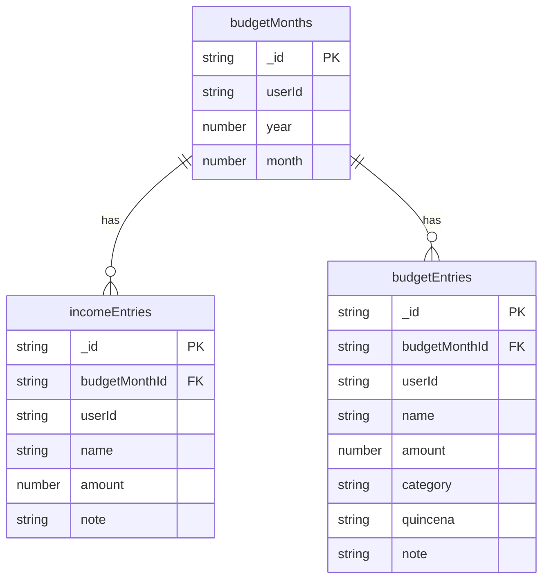
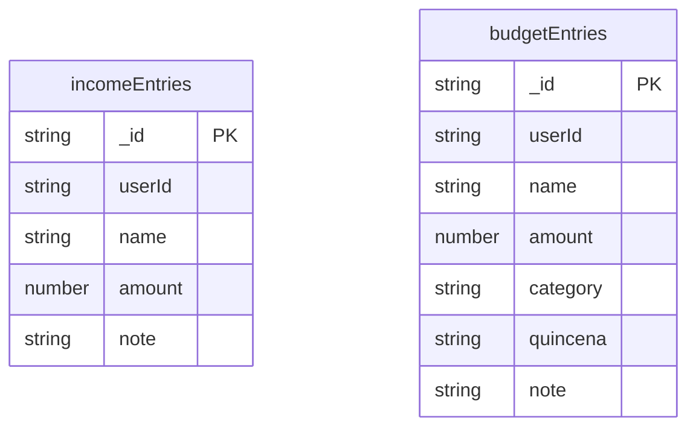

# Static Expense Tracker Refactoring Plan

## Overview

Transform the existing monthly budget application into a static expense tracker with a single, persistent view. Remove all month-based navigation and data organization while preserving the quincena (bi-weekly payment) concept and category system.

## Current Architecture

## Target Architecture

## Key Changes

### 1. Database Schema Changes

**File:** [`packages/backend/convex/schema.ts`](packages/backend/convex/schema.ts)

- Remove `budgetMonths` table entirely
- Remove `budgetMonthId` field from `incomeEntries`
- Remove `budgetMonthId` field from `budgetEntries`
- Update indexes:
  - `incomeEntries`: Change from `by_budget_month` to `by_user`
  - `budgetEntries`: Change from `by_budget_month` to `by_user`

### 2. Backend Function Changes

**File:** [`packages/backend/convex/budget.ts`](packages/backend/convex/budget.ts)

| Function            | Action                                            |
| ------------------- | ------------------------------------------------- |
| `getOrCreateMonth`  | DELETE - No longer needed                         |
| `getMonthData`      | REPLACE with `getData` - Returns all user entries |
| `listMonths`        | DELETE - No longer needed                         |
| `upsertIncomeEntry` | MODIFY - Remove `budgetMonthId` parameter         |
| `deleteIncomeEntry` | KEEP - No changes needed                          |
| `upsertBudgetEntry` | MODIFY - Remove `budgetMonthId` parameter         |
| `deleteBudgetEntry` | KEEP - No changes needed                          |

### 3. Frontend Changes

**File:** [`apps/web/src/routes/dashboard.tsx`](apps/web/src/routes/dashboard.tsx)

- Remove `MonthNavigator` component
- Remove year/month state management
- Remove `budgetMonthId` state
- Remove `ensureMonth` callback and loading state
- Simplify `BudgetDashboard` to directly render `BudgetContent`
- Update `BudgetContent` to use new `getData` query

**File:** [`apps/web/src/components/budget/MonthNavigator.tsx`](apps/web/src/components/budget/MonthNavigator.tsx)

- DELETE this file entirely

**File:** [`apps/web/src/components/budget/types.ts`](apps/web/src/components/budget/types.ts)

- Remove `BudgetMonth` interface
- Remove `budgetMonthId` from `IncomeEntry` and `BudgetEntry` interfaces
- Remove `MonthData` interface, replace with simpler `UserData`
- Remove `MONTH_NAMES` constant

### 4. Component Updates

**Files to update:**

- [`AddEntryDialog.tsx`](apps/web/src/components/budget/AddEntryDialog.tsx) - Remove `budgetMonthId` from handlers
- [`CategorySection.tsx`](apps/web/src/components/budget/CategorySection.tsx) - No major changes
- [`EntryRow.tsx`](apps/web/src/components/budget/EntryRow.tsx) - No major changes
- [`IncomeSection.tsx`](apps/web/src/components/budget/IncomeSection.tsx) - No major changes
- [`OverviewPanel.tsx`](apps/web/src/components/budget/OverviewPanel.tsx) - Update to use new data structure

## Implementation Order

1. **Schema Migration** - Update Convex schema first
2. **Backend Functions** - Update queries and mutations
3. **Types** - Update TypeScript type definitions
4. **Frontend** - Update dashboard and remove MonthNavigator
5. **Cleanup** - Remove unused files and code

## Data Migration Strategy

Since this removes the `budgetMonths` table, existing data will be migrated:

**Migration Approach:** Preserve entries from the most recent month

1. Create a migration script that:
   - Finds the most recent `budgetMonth` for each user
   - Copies all `incomeEntries` and `budgetEntries` from that month to new user-level entries
   - Removes the `budgetMonthId` field from copied entries
   - Deletes all old `budgetMonths` and their associated entries

2. Migration steps:
   - Add new schema alongside existing (temporary)
   - Run migration to copy data
   - Remove old schema
   - Clean up temporary tables

## Files to Modify

| File                                                | Action |
| --------------------------------------------------- | ------ |
| `packages/backend/convex/schema.ts`                 | MODIFY |
| `packages/backend/convex/budget.ts`                 | MODIFY |
| `apps/web/src/routes/dashboard.tsx`                 | MODIFY |
| `apps/web/src/components/budget/types.ts`           | MODIFY |
| `apps/web/src/components/budget/AddEntryDialog.tsx` | MODIFY |
| `apps/web/src/components/budget/OverviewPanel.tsx`  | MODIFY |
| `apps/web/src/components/budget/MonthNavigator.tsx` | DELETE |

## Summary

This refactoring simplifies the budget application by:

1. Removing the temporal dimension (months) from the data model
2. Creating a single, evergreen view of all expenses
3. Preserving the quincena concept for bi-weekly payment tracking
4. Maintaining the 50/30/20 budget category system
5. Keeping income tracking functionality

The result is a static expense tracker where users enter fixed costs once and they remain visible indefinitely.
